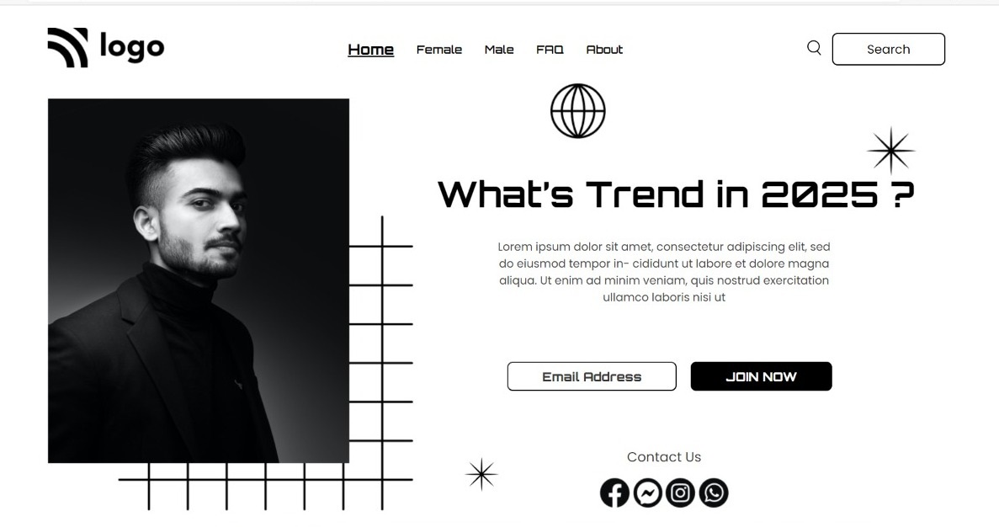

# Assignment-1 
## (Street Style Landing Page) 

> In this project, I have used HTML (the Hypertext Markup Language) and CSS (Cascading Style Sheets), which are two of the core technologies for building Web pages. It is a static and non-responsive page.

### As a result of this project, I learn the following:
[LIVE-LINK](https://streetstylelanding.netlify.app/)

- [x] positioning property in the HTML and CSS
- [x] use pseudo classes 
- [x] About and use z-index
- [x] learned about margin and padding

#### The duration of the project:4hour
